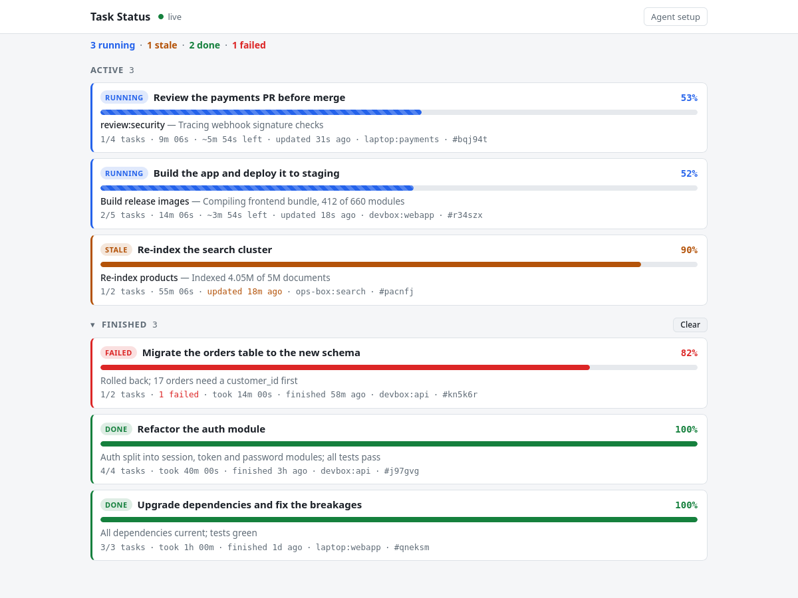
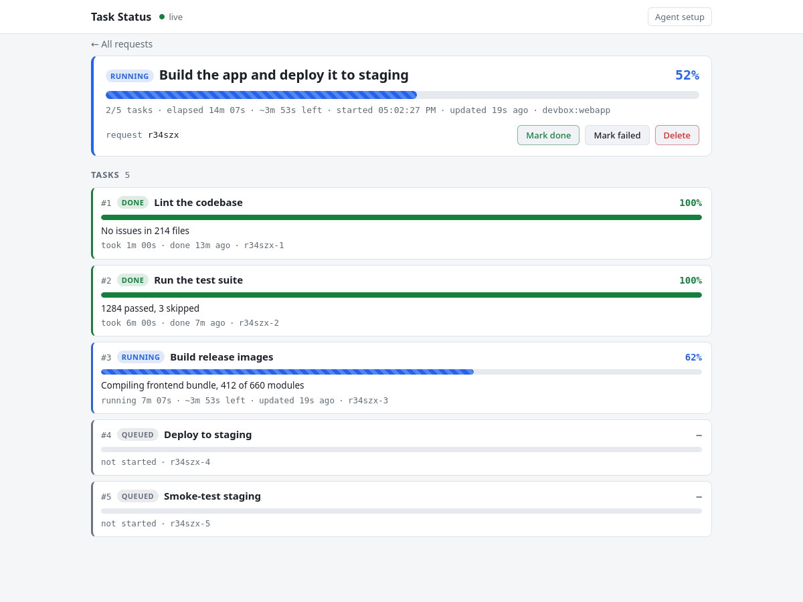
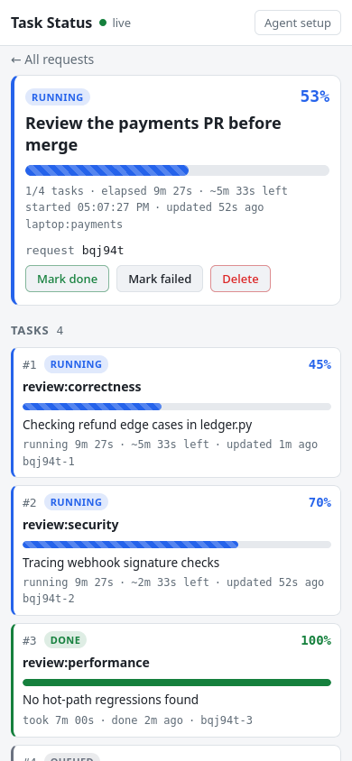

# agent-task-display

A small live status board for [Claude Code](https://claude.com/claude-code) agents. Stop asking an
agent "status?". It reports to a web page as it works: one entry per thing you asked for, one line per
step or subagent, each with a percent, a hint of what is happening right now, and an ETA. You keep the
page open on another screen or on your phone. The board is a Python standard-library HTTP server with
SQLite and a single-file web UI. Agents report with `taskctl`, a small CLI, and a Claude Code skill
tells them when to use it. Agents on other machines can install the skill and CLI from the board with
one `curl` line.



## Contents

- [Concepts](#concepts)
- [Quickstart (board host)](#quickstart-board-host)
- [Agents on other machines](#agents-on-other-machines)
- [Using it from Claude Code](#using-it-from-claude-code)
- [The dashboard](#the-dashboard)
- [taskctl reference](#taskctl-reference)
- [HTTP API](#http-api)
- [Networking and security](#networking-and-security)
- [Data and retention](#data-and-retention)
- [Running the tests](#running-the-tests)
- [Repository layout](#repository-layout)

## Concepts

- **Request**: one per user request, such as "Build the app and deploy it to staging". It has an id
  like `k3m9qa`, a page at `/r/k3m9qa`, and an origin (`taskctl` sets it to `host:directory`).
- **Task**: one per step, or one per agent in a workflow. Its id is the request id plus a sequence
  number, such as `k3m9qa-3`. The agent plans tasks when it opens the request and can add more later.
- **Task status**: `pending` (the UI shows it as *queued*), `running`, `done`, `failed` or `cancelled`.
  A request is `running`, `done` or `failed`.
- **Stale** is derived, not stored. Running work shows as stale when it has sent no update for 10
  minutes (`--stale-after`). Work inside its ETA, or less than 60 s past it, is not stale.
- **Percent**: the request's percent is the average over its tasks, with done tasks counted as 100.
  **X/Y** counts done tasks out of all tasks. Cancelled tasks are left out of both.
- **Elapsed** runs from when a task started, or from when the request was created, until it finishes.
  **ETA**: a task's ETA is whatever the agent last reported. A request's ETA is the latest ETA among
  its running tasks.
- **Closing a request cascades**: its pending tasks become cancelled, and its running tasks take the
  request's status. Adding a task to a closed request reopens it.

## Quickstart (board host)

Requirements: Python 3.10+ (with SQLite 3.37+) and `curl` on the machine that runs the board. Agent
machines need only Python 3.8+ and `curl`. `tasks.sh` is a bash script for Linux. On other systems,
run `python3 tasks/server.py` directly.

```sh
git clone https://github.com/RetroZelda/agent-task-display.git
cd agent-task-display
./tasks.sh --bg              # start the board in the background (port 8765); prints its URLs
```

Open `http://localhost:8765/`, or `http://<lan-ip>:8765/` from another device.

```sh
./tasks.sh --install-skill   # starts the board if needed, then installs the skill and the rule
./tasks.sh --status          # URLs, health, database, log, skill and rule state; exit 3 if not running
./tasks.sh --stop            # SIGTERM, then SIGKILL after 5 s
./tasks.sh                   # run in the foreground instead (Ctrl-C stops it)
```

`--install-skill` writes to `${CLAUDE_CONFIG_DIR:-~/.claude}`:

- `skills/task-status/SKILL.md`, `taskctl` and `taskctl.py`. This is the skill plus its CLI, which
  has this board's URL built in.
- A short rule block in `CLAUDE.md`, between `<!-- task-status:begin -->` and
  `<!-- task-status:end -->`. The rule tells every session when to use the skill. The command creates
  the file if it is missing and updates the block in place, leaving the rest of the file as it was.

It never edits `settings.json`. Instead it prints recommended `permissions.allow` entries for you to
add. Every report is a Bash call, so without these entries you get a permission prompt for each
report, and subagents may be refused:

```json
"Bash(/home/you/.claude/skills/task-status/taskctl new *)",
"Bash(/home/you/.claude/skills/task-status/taskctl add *)",
"Bash(/home/you/.claude/skills/task-status/taskctl start *)",
"Bash(/home/you/.claude/skills/task-status/taskctl progress *)",
"Bash(/home/you/.claude/skills/task-status/taskctl done *)",
"Bash(/home/you/.claude/skills/task-status/taskctl fail *)",
"Bash(/home/you/.claude/skills/task-status/taskctl show *)",
"Bash(/home/you/.claude/skills/task-status/taskctl list *)",
"Bash(/home/you/.claude/skills/task-status/taskctl ping *)"
```

`taskctl run` is left out on purpose, because it runs an arbitrary command. Start a new Claude Code
session, or run `/reload-skills`, to load the skill.

Launcher options: `--host HOST` (default `0.0.0.0`), `--port PORT` (8765), `--db PATH`
(`tasks/data/tasks.db`) and `--public-url URL`. Each also reads an environment variable: `TASKS_HOST`,
`TASKS_PORT`, `TASKS_DB` and `TASKS_PUBLIC_URL`. See `./tasks.sh -h`.

## Agents on other machines

Give the agent this one line. `./tasks.sh --bg` and `./tasks.sh --status` print it with the board's
address filled in (when the board listens on the LAN, i.e. not with `--host 127.0.0.1`):

```
Run `curl -fsS --noproxy '*' --connect-timeout 5 http://<board-host>:8765/api/usage` and follow it.
```

`/api/usage` is written for agents. It has the command that installs the skill and CLI from
`/api/skill/SKILL.md`, `/api/skill/taskctl` and `/api/skill/taskctl.py` (the served `taskctl.py` has
the URL the agent used built in). It also has the rule block from `/api/rule`, the permission entries
to propose, and the HTTP API for agents that are not Claude Code. The instructions tell the agent to
ask its user before it installs anything, before it adds the rule to `CLAUDE.md`, and before any
permission change. The agent never edits `settings.json` itself.

- **Windows**: run the commands from Git Bash (Claude Code's Bash tool), not PowerShell. The
  `taskctl` wrapper tries `python3`, `python` and `py -3`.
- **Proxies**: every command uses `--noproxy '*'`, because a proxy set in `http_proxy` would not reach
  a LAN address.
- **Hostname URLs** can resolve to an IPv6 link-local address, which is common on Windows and with
  `.local` names. If `http://myhost:8765` hangs, use the IP address, or open IPv6 in the firewall
  ([below](#networking-and-security)).

## Using it from Claude Code

Once the skill is installed, it triggers on its own before multi-step or long work, before background
commands, before subagents or a Workflow, when a prompt contains a task id, and when you ask for
status. The agent opens a request with its tasks planned, gives you the page link, reports at
milestones, and closes every task and then the request. It closes them on failure too. A status
question is answered from `taskctl show`, not from the agent's memory.

**Workflows and subagents.** A Workflow script has no network access, and a subagent may not have the
skill loaded. So the orchestrating session does the setup:

1. It opens the request with one `-t` per planned agent:

   ```sh
   taskctl new 'Review the payments PR before merge' -t 'review:correctness' -t 'review:security' -t 'review:performance'
   # stdout: k3m9qa, k3m9qa-1, k3m9qa-2, k3m9qa-3   stderr: the page link
   ```

2. It puts a reporting block in each agent's prompt, with that agent's task id and the absolute
   `taskctl` path:

   ```
   ## STATUS REPORTING (required, the user is watching this live at http://<board-host>:8765/r/k3m9qa)
   You own task k3m9qa-2. Titles and hints go in SINGLE quotes, with no backticks, $ or quote characters:
     /home/you/.claude/skills/task-status/taskctl start k3m9qa-2 'short hint'
     /home/you/.claude/skills/task-status/taskctl progress k3m9qa-2 <0-100> 'what you are doing now' --eta 5m
     /home/you/.claude/skills/task-status/taskctl done k3m9qa-2 'one-line result'   (or: fail k3m9qa-2 'reason')
   Run start first, report at milestones only, and make done/fail your last action.
   ```

3. Agents that are only known at run time register themselves with
   `taskctl add --start k3m9qa 'fix:test_login'` and use the task id it prints.

4. When the agents return, the orchestrator runs `taskctl show k3m9qa`. It fails any task left behind
   by an agent that crashed, then closes the request with `taskctl done k3m9qa 'one-line summary'`.

The full wording, including the template for agents that register themselves, is in
[`tasks/skill/SKILL.md`](tasks/skill/SKILL.md).

## The dashboard

<p>
  
  
</p>

- The list shows the active requests first, then the finished ones, with running, stale, done and
  failed counts at the top. Each request's page lists its tasks, and `/r/<rid>#<tid>` links straight
  to one task.
- The page polls every 1.5 s and backs off while the board is unreachable. It follows the system's
  light or dark theme and works at phone width.
- **Mark done**, **Mark failed** and **Delete** act on a request. **Clear** deletes the finished
  requests listed. **Agent setup** opens `/api/usage`.

## taskctl reference

The installed CLI is `~/.claude/skills/task-status/taskctl`. From a clone, it is `tasks/taskctl`.

| Command | What it does |
|---|---|
| `new TITLE [-t TASK]...` | Open a request. Prints its id, then one task id per `-t`. |
| `add RID TITLE... [--start]` | Add pending tasks, or one running task with `--start`. Prints their ids. Reopens a closed request. |
| `start TID [HINT]` | Mark a task running. Its elapsed time counts from now. |
| `progress TID PCT HINT [--eta DUR]` | Percent (`45`, `45.5` or `45%`), what is happening now, and an optional ETA (`90`, `90s`, `5m`, `1h30m`, `1:30:00`). Leaving out `--eta` clears the ETA. |
| `done ID [MSG]` | Close a task, or a whole request (cascades), as done. |
| `fail ID MSG` | Close a task or request as failed, with a reason. |
| `show ID` | A request with its tasks, or one task. |
| `list [--all]` | Every running request. `--all` adds the 20 most recently finished. |
| `ping` | Check the board. Prints its URL. |
| `run TID [--every SEC] [--percent-regex RE] -- CMD...` | Run a command and report its output as it goes (below). |
| `install-rule [--file PATH]` | Add or update the rule block in `${CLAUDE_CONFIG_DIR:-~/.claude}/CLAUDE.md`. |

Global options, before or after the subcommand:

- `--url URL`. Otherwise it uses `$TASKS_URL`, then the URL built into the file, then
  `http://127.0.0.1:8765`.
- `--timeout SEC`. Otherwise `$TASKS_TIMEOUT`, then 3 s. An invalid value produces a warning and
  falls back to 3 s.
- `--strict`, or `TASKS_STRICT=1`.

The id's shape decides whether `done`, `fail` and `show` act on a request or a task. stdout carries
only ids, URLs and the `show`/`list` tables, so scripts can capture them. Notes go to stderr, prefixed
`taskctl:`.

**Reporting never breaks the real work.** If the board is unreachable or rejects a call, `taskctl`
prints a warning and exits 0. When `new` or `add` cannot get ids, they print `offline` once for each
id they would have printed. Any command given the id `offline` then does nothing, so captured ids keep
working. If no Python 3.8+ is found, the wrapper behaves the same way. Usage errors always exit 2. With
`--strict`, a rejected call exits 1 and an unreachable board exits 3. `install-rule` is a setup
command, so its failures exit 1.

**`run`** wraps a command so that background work reports on its own:

```sh
taskctl run k3m9qa-2 --percent-regex '(\d+)/(\d+)' -- ./run_tests.sh
```

It starts the task and passes the command's output through unchanged. It sends the latest output line
as the hint, at most every `--every` seconds (default 10), plus a heartbeat every minute. The regex
takes one group (a percent) or two groups (done and total). When the command exits, `run` closes the
task as done, or as failed with the exit code and the last line of output, and exits with the
command's own status.

## HTTP API

JSON in and out. Every write is a plain `curl` call, so any agent or script can report without
`taskctl`. The full reference for agents is served at `/api/usage`, and the exact contract, covering
shapes, validation, errors and state rules, is the module docstring of
[`tasks/server.py`](tasks/server.py).

| Method | Path | Purpose |
|---|---|---|
| GET | `/` | The dashboard in a browser. Anything else gets the usage text. |
| GET | `/r/<rid>` | A request's page |
| GET | `/api`, `/api/usage` | Instructions for agents (plain text) |
| GET | `/api/rule` | The `CLAUDE.md` rule block |
| GET | `/api/skill/SKILL.md`, `/api/skill/taskctl`, `/api/skill/taskctl.py` | The skill and CLI files (`taskctl.py` has the board URL built in) |
| GET | `/api/health` | `{ok, service, version, pid, now, started_at, requests_running}` |
| POST | `/api/requests` | Create a request: `{title, origin?, tasks?: [title]}` |
| GET | `/api/requests` | List: running requests first, then finished ones (`?status=`, `?limit=`) |
| GET | `/api/requests/<rid>` | One request with its tasks |
| DELETE | `/api/requests/<rid>` | Delete a request and its tasks |
| POST | `/api/requests/<rid>/complete` | Close it: `{status?: done\|failed, message?}` (cascades) |
| POST | `/api/requests/<rid>/tasks` | Add tasks: `{title, start?}` or `{titles: [...]}` |
| GET | `/api/tasks/<tid>` | One task |
| POST | `/api/tasks/<tid>/progress` | `{message, percent?, eta_seconds?}` |
| POST | `/api/tasks/<tid>/complete` | `{status?: done\|failed, message?}` |

```sh
curl -sS --noproxy '*' -X POST http://<board-host>:8765/api/tasks/k3m9qa-2/progress \
  -H 'Content-Type: application/json' \
  -d '{"percent": 45, "message": "Compiling 812 of 2000", "eta_seconds": 300}'
```

## Networking and security

- **It listens on every interface.** By default it binds `0.0.0.0`. The socket is dual-stack, so it
  accepts IPv4 and IPv6 on one port, and falls back to IPv4 only when the host has no IPv6. Use
  `--host 127.0.0.1` to keep it on the local machine.
- **There is no authentication.** Anyone who can reach the port can read every request, create or
  close requests, and delete them. Run it only on a trusted LAN. Never expose it to the internet.
  Never put secrets in titles or hints.
- **Browser writes are guarded.** A POST or DELETE that carries an `Origin` header is refused (403)
  unless the Origin matches the Host, and the Host is an IP address, `localhost`, the machine's
  hostname or the `--public-url` host. This blocks cross-site requests and DNS rebinding. `curl` and
  `taskctl` send no Origin, so they are unaffected. If you reach the UI under another name, pass it as
  `--public-url` so the UI's buttons keep working.
- **Agent text is shown as text.** Titles, hints and messages are rendered as plain text, never as
  HTML, so a report cannot inject script. A Host header is built into the served files only if it is a
  plain `host[:port]`.
- **Firewall**: `./tasks.sh --status` reads ufw's state and prints the rule you need, if any. For
  example, for a `192.168.1.0/24` LAN:

  ```sh
  sudo ufw allow from 192.168.1.0/24 to any port 8765 proto tcp   # LAN over IPv4
  sudo ufw allow from fe80::/10 to any port 8765 proto tcp        # hostname URLs that resolve to IPv6
  ```

- **Link URLs**: the `url` fields and page links the board hands out start with `--public-url`. When
  the LAN can reach the board, `tasks.sh` sets `--public-url` to `http://<lan-ip>:<port>`. Otherwise
  links use the address each client connected to. Set `--public-url` yourself for a DNS name or a
  reverse proxy.

## Data and retention

State lives in SQLite at `tasks/data/tasks.db`, next to the pidfiles. The directory is gitignored.
`tasks.sh --bg` logs to `.logs/tasks_server.log`, which is also gitignored. These server flags control
aging:

| Flag | Default | Meaning |
|---|---|---|
| `--stale-after` | `600` (10 min) | Seconds without an update before running work shows as stale |
| `--expire-after` | `86400` (24 h) | Seconds without activity before a running request is closed as failed ("expired: no activity for 24h"). `0` disables it. |
| `--retention-days` | `30` | Days to keep finished requests before deleting them. `0` keeps them forever. |

A maintenance pass runs at startup and then every 10 minutes or less. `tasks.sh` does not pass these
three flags through, so to change them, run the server directly, for example
`python3 tasks/server.py --retention-days 7`. See `python3 tasks/server.py --help`.

## Running the tests

```sh
tests/run_all.sh
```

See [`tests/README.md`](tests/README.md) for what the suites cover and how they isolate themselves
from your real board and `~/.claude`.

## Repository layout

```
tasks.sh                  launcher: run, --bg, --stop, --status, --install-skill
tasks/server.py           HTTP server and SQLite store; its docstring is the API contract
tasks/static/index.html   the dashboard (one file, no build step)
tasks/taskctl             POSIX sh wrapper: finds Python 3.8+ and runs taskctl.py
tasks/taskctl.py          the CLI (standard library only)
tasks/skill/SKILL.md      the Claude Code skill, served at /api/skill/SKILL.md
tasks/templates/usage.md  instructions for agents, served at /api/usage
tasks/templates/rule.md   the CLAUDE.md rule block, served at /api/rule
tasks/data/               database and pidfiles (created at run time, gitignored)
tests/                    test suites (tests/run_all.sh)
docs/                     screenshots used in this README
```
